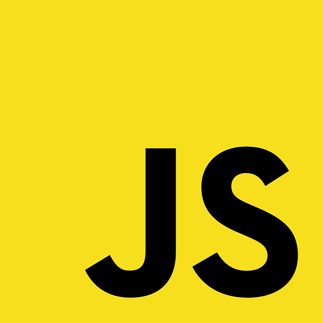

## First Impressions - The Freedom of JavaScript
As a beginner programmer with a year of Java experience (and a little in Python), I didn't know what to expect with JavaScript. I'd somewhat assumed JavaScript was just another variant of Java, but I soon discovered that there is so much more to this language! Unlike Java, which has a hierarchical structure, many specific and strict variable types, and long method declarations, I found that JavaScript is more like Python. JavaScript, like Python, doesn't make programmers restrict variables or arrays to specific types, and functions are easy to create and can be utilized in many ways that Java doesn't allow. For instance, functions can be used as variables, which boggled me because in Java, methods, which are basically functions, most certainly cannot be used this way. This freedom JavaScript provides definitely appealed to me when I began my very first lessons on the language using the site [FreeCodeCamp](https://www.freecodecamp.org/learn/javascript-algorithms-and-data-structures/).

## Downsides
However, as I continued learning, I soon came to realize a couple some downsides to this freedom. Sometimes JavaScript code can get messy and hard to read. I've provided code below for an object called messy to illustrate my point. This code is most definitely daunting. There are arrays nested in objects, objects nested in arrays, and so on, which is a lot to keep track of for beginner programmers! To tell the truth, FreeCodeCamp lessons that dealt with these sorts of structures took the most time for me to complete.
```
const messy = {
  stuff: [{
      dog: 'Pomeranian',
      cat: 'Maine Coon',
      horse: 'Stallion',
    },
    [6, 'random', 12, 2.0],
  ],
  'more stuff': [
    ['nested'],
    ['also nested'],
  ]
}
```
Not to mention, JavaScript lacks certain benefits that other languages provide. This includes the great amount of organization Java has with its use of classes, interfaces, and inheritance. In addition, JavaScript seems to have harder syntax than Python, another language I am just a few days into learning. For instance, most variables in JavaScript must be declared using let, const, or var, but in Python, there is no such syntax.
### JavaScript
```
const num = 5;
```
### Python
```
num = 5
```
## Tackling the Language - Problem Solving
Nevertheless, I am a beginner, and I'm sure my problems with JavaScript stem mostly from my lack of familiarity with the language. I'm hopeful I'll become comfortable with JavaScript over time, especially with the way my professor is teaching my software engineering class. In particular, my professor is utilizing an athletic teaching method in which students are presented with JavaScript problems that they need to solve within a short time frame. These problems are known as Workouts of the Day (WODs), and they really make students think on their feet and apply problem-solving knowledge. I have not completed many WODs so far, but honestly, I am excited to get into the process. I feel that I'm already learning how to act more dynamically with this type of assignment. In fact, I'd say that no matter what language one is learning, problem-solving practice, whether it be in a programming class or on sites like [Edabit](https://edabit.com/challenges), is a great way to improve one's programming.

## Last Thoughts
With that being said, I'm confident that in time I'll be able to read and write JavaScript easily and as, if not more, proficiently than I have with Java. This language may be daunting at first, but that's only natural. For any language, be it programming or otherwise, it takes a while to adjust, but if I commit myself to learning, JavaScript code will become second nature. My prospects for the future are high!

Image Source: [Pixabay](https://pixabay.com/vectors/javascript-js-logo-source-code-736400/)
