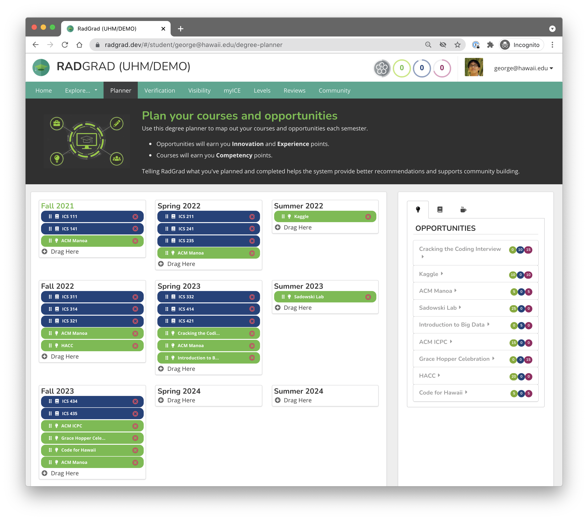

## What is RadGrad
[RadGrad](https://www.radgrad.org/) is a site that helps UH Manoa students in computer science find interests, career goals, opportunities, and classes pertaining to their majors. Not to mention, students can build social networks, become more experienced and confident, improve their resumes, and plan their futures with the use of RadGrad. I was amazed by all that RadGrad offered when I began my journey through the site. 

## My Experience

### Courses, Interests, Careers
The first thing I did after I created a RadGrad account was look through the different ICS courses the RadGrad course explorer contained. I was surprised to find that there were 106 different ICS courses listed. Most of these courses are new to me and encompass topics including data science, artificial intelligence (AI), software engineering, security, and machine learning. For instance, there is a class on deep learning, which involves machine learning, AI, and neural networks. I'm taking an introductory course to machine learning this semester, so its exciting to see how machine learning can be used in upper-level courses. After looking through the courses, I also checked the interests and careers provided by RadGrad and learned about programming languages I didn't know before, such as Ruby and Swift. However, what struck me the most was the opportunities section provided by RadGrad.

### Opportunities
I've always had difficulties adding extracurriculars to my resume, so the opportunities section of RadGrad caught my interest right away. When I looked into the opportunities, I found many local ones I could take advantage of, including [ACM Manoa](https://acmanoa.github.io/), [Kaggle](https://www.kaggle.com/) and [Code for Hawaii](http://www.codeforhawaii.org/). I'd actually never known about most of these activities before, and I may not ever have if it weren't for RadGrad, so I'm thankful I did.

### Planner
After finding interests, courses, careers, and opportunities through RadGrad, I learned about about one of its most convenient features: the RadGrad planner. In this planner, I can choose when I participate in different courses and opportunities and organize all of this information in one place so I can keep track of it and change it when needed. 

On a side note, I discovered that I can even add internships to my planner. From what I've heard, internships are one of the most important parts of getting a job after college, so I'm hopeful I'll be able to add some to my planner eventually. It's great that RadGrad provides so many features!

## Use RadGrad
To conclude, RadGrad is an extremely helpful site providing much needed guidance to computer science students from the University of Hawaii at Manoa. If you're a UH Manoa student wanting to get your life together, use RadGrad. You'll be *grad* you did.

Image Source: [RadGrad Planner](https://www.radgrad.org/docs/users/new-student/planner)
