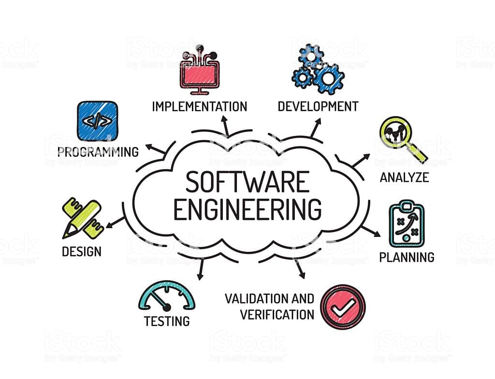

## A Brand New Experience

I took a software engineering class for the first time ever this Fall 2021 semester, and it was a class to remember. There was always something new to learn, whether it be using JavaScript, building a portfolio page, utilizing different software engineering technologies, working in a team, or creating and designing a web application. The course was very dynamic, but it was never too much to handle all at once. And from my experience, I learned a great deal of information that can be applied even outside the realm of software engineering: in particular, functional programming, coding standards, and agile project management.

## The Beauty of Functional Programming with JavaScript

What exactly is functional programming? Eric Elliot from [Medium](https://medium.com/) defines functional programming as follows:

> the process of building software by composing pure functions, avoiding shared state, mutable data, and side-effects. 

In my class, we focused on the use of functional programming in JavaScript, in which functional programming is an optional construct. We concentrated on three main ideas in regards to functional programming: using functions like any other data type, as return values to functions, or as arguments to other functions. To implement these ideas in code, we utilized a library called [Underscore](http://underscorejs.org/#), and let me just say, I had a great time using it. The library provides so many useful functions. For instance, Underscore has a function called map, which can transform each value in a list in just a single line of code unlike a for loop. While functional programming has been helpful for software engineering, I also see it being useful in programming in general.

Functional programming allows programmers to reduce the amount of code they use as well as the potential amount of bugs in code, in turn, enabling speedy programming. What programmer wouldn't want that? For instance, imagine a programmer who's about to get their code critiqued. They should be mindful of their reviewer and want their code to look as simple and clean as possible, and functional programming is just the right tool for the job. As such, functional programming is useful in many contexts. I can see myself applying functional programming for both small assignments and large projects in programming. Functional programming is an innovative way to program that more people should know about. What about coding standards?

## Coding Standards set the Rules

Coding standards are like the English language: they provide a set of rules that structure what programmers write so that it is neat, readable, and less prone to errors. There are many different variations of coding standards programmers can follow. I've recently used [ESLint](https://eslint.org/) as a tool to ensure my code follows JavaScript coding standards. However, there are plenty of other rules and tools available to structure code no matter the language. And they can be very helpful! I know this from personal experience, having used ESLint continuously in a month-long project called [Bridging the Gap](https://bridging-the-gap.github.io/). ESLint enabled me to catch code that wasn't being used, code that wasn't defined, and code that was syntactically incorrect. For instance, ESLint always caught import statements that weren't being used in files, which was convenient for me as it allowed me to locate these import statements, delete them, clean up code, and limit any future confusion arising from the presence of these unused statements. 

Like functional programming, I believe coding standards can be applied anywhere in the field of programming. For instance, coding standards can help students organize their code so that TAs or professors reviewing it will have less trouble understanding what students have done. In addition, when working on a project, tools used to enforce coding standards can help catch tricky bugs that could've caused collateral damage to a system had they not been caught. Not to mention, these tools can locate and delete code that is not being used or defined, making code clearer to the user. Coding standards uses are limitless, no matter whether one is programming in Java, JavaScript, Python, C++, etc. Agile project management is also quite helpful.

## Keep on Track with Agile Project Management

Agile project management is an efficient strategy to manage projects. It's characterized by time-boxed releases of a system, making something useful quickly, continuous and dynamic planning, specifying features of a system as they are implemented, and continuously testing a system as it is built. For the Bridging the Gap project, I worked in a team of five, and we utilized a specific type of agile project management, issue-driven project management.

Issue-driven project management is a strategy for managing projects for a group of 10 people or less. There are a few key features of issue-driven project management that I will explain in the context of [GitHub](https://github.com) since that is how I implemented this type of project management. First off, it involves the use of time-limited milestones that represent major advancements in a system. These milestones are managed by project boards. Within these project boards, we can add issues, which are each assigned to one team member. These issues come from splitting up the work for a milestone into several different tasks that can be accomplished in around three days. And throughout the project, each team member should be responsible for an issue. 

It is evident how agile project management and issue-driven project management would be useful outside the field of software engineering and without the use of GitHub. I can see agile project management being used by a group of engineers creating a robot, a group of friends planning a wedding, a team competing in a sculpture-making competition, a theater group designing a play, and much much more! Personally, I could see myself using agile project management to help me fulfill a year-long goal, such as developing a good resume filled with jobs, volunteer work, experience, and awards. Out of everything I discussed, I see agile project management by far having the most widely applicable uses. However, functional programming, coding standards, and agile project management are all useful in their own unique ways.

## End of the Beginning

This semester, I started out as a newbie but transformed into a skilled software engineer. I've learned so much about software engineering, including functional programming, coding standards, and agile project management. I'm confident these concepts will stick with me and carry me into a promising future.

Information Resources:
1. [Agile Project Management](https://courses.ics.hawaii.edu/ics314f21/morea/project-management/reading-screencast-idpm.html)
2. [Coding Standards](https://courses.ics.hawaii.edu/ics314f21/morea/coding-standards/reading-screencast-coding-standards.html)
3. [Functional Programming](https://courses.ics.hawaii.edu/ics314f21/morea/javascript-3/reading-screencast-functional-programming-javascript.html)

Picture Source:
[Software Engineering](https://logicalbaat.com/importance-of-software-engineering/)
