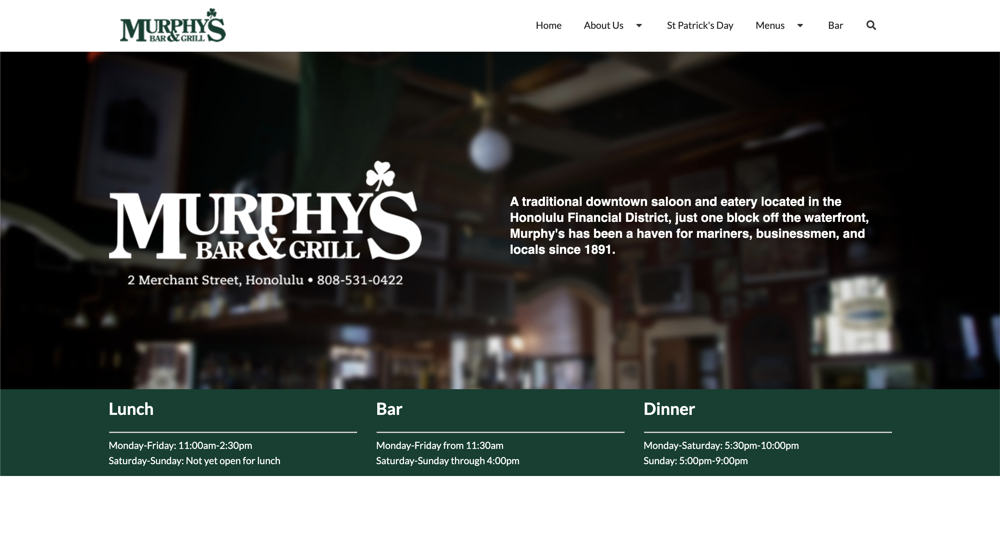

## UI Frameworks
When it comes to designing webpages, UI frameworks are a handy tool, offering many functionalities that simplify development and promote the creation of gorgeous, sophisticated, and innovative webpages and websites. These frameworks make use of Cascading Style Sheets (CSS), a language used to style webpages, giving them colors, borders, backgrounds, and the like. And both UI frameworks and CSS are paired with the most well-known language used in creating and displaying content on webpages, HyperText Markup Language (HTML). There is a multitude of different UI frameworks available, such as Query, Metro UI CSS, Foundation, Twitter Bootstrap, along with Semantic UI, the framework I'm currently using.

## Diving into Semantic UI

### First Impressions

I started learning Semantic UI earlier this week in my software engineering class. Prior to this, I had solely been using CSS to style elements in my HTML files for class assignments, and I was pretty comfortable with CSS alone. So much so in fact, that when I was introduced to Semantic UI, I believed that this UI framework would become a unnecessary burden on me. I thought to myself, "I already have to organize all of my HTML and CSS, and now I have to keep track of Semantic UI? This is going to be difficult." Taking a look at the [documentation](https://semantic-ui.com/introduction/getting-started.html) for Semantic UI didn't help. When I first looked at the Semantic UI site, I was overwhelmed with all the framework has to offer: from grids to dropdowns to breadcrumbs to accordions, it seemed that learning Semantic UI would be no easy task. 

### Problems I've Faced
And I'll admit, Semantic UI has been a little difficult, especially when it comes to getting elements, most notably text and images, to appear in the right position on a webpage. One of the problems I have is finding out what exact Semantic UI classes I need to use. For instance, when I was centering a header for one of my homework assignments, I was confused on whether the UI class "centered", "center aligned", or "middle aligned" was more appropriate for the task. Not to mention, I also have some difficulty comprehending how inheritance works with Semantic UI and how I can override certain styles and get certain other styles to appear. Whenever I have inheritance-related issues, I often fix them by applying style directly to elements in my HTML files instead of using classes from my CSS stylesheet or Semantic UI, which is rather unfortunate. Inheritance is one tricky pickle, that's for sure. However, this is all part of the learning process. And although I've had my issues with Semantic UI, after practicing with it more, I began to truly appreciate the framework for how cool it is.

### The Beauty of Semantic UI
Semantic UI enables me to create actual professional-looking webpages with all different kinds of functionalities in a simpler and more efficient manner than CSS and HTML alone can. With Semantic UI, I can create menus with different tabs, dropdowns, rows and columns of organized content, actual animations, and much more, and all I really need to do is utilize the Semantic UI classes and apply them to my HTML elements! I began understanding how to do this correctly a few days into Semantic UI, and as soon as I did, integrating Semantic UI into my projects has become an overall great experience, especially when I can analyze the final product of my work and think to myself, "wow, I built this?" For instance, here's a webpage I replicated using Semantic UI.

Being able to create webpages such as the one, especially just starting out with web design, showed me that Semantic UI is worth learning. I’m definitely glad that I did.

## How Semantic UI Style Shaped a Smile
I truly feel that I am becoming a more experienced software engineer thanks to learning Semantic UI, as well as CSS and HTML in general. I'd always thought that creating webpages was a complex project, and don't get me wrong, it's not exactly trivial, especially the more you add to the page. However, Semantic UI taught me that designing a good webpage just takes a little time, effort, and ingenuity, which may seem simple, but sometimes, it’s all you really need in the end.

Image Sources:
- [Semantic UI Logo](https://freebiesupply.com/logos/semantic-ui-logo/)
- [Murphy's Original Website](https://www.murphyshawaii.com/)
