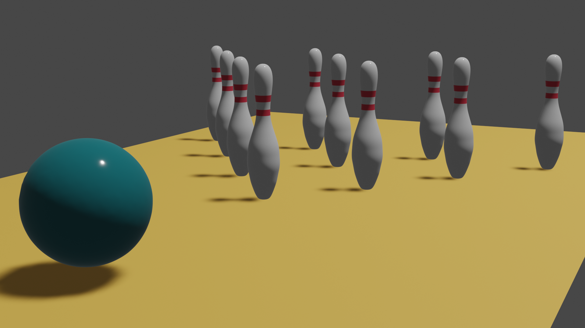
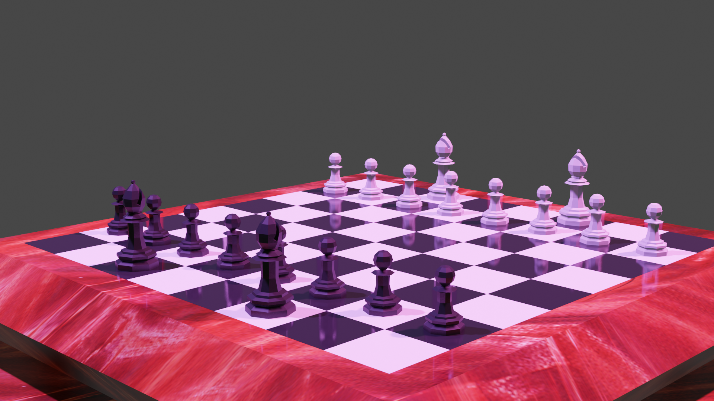
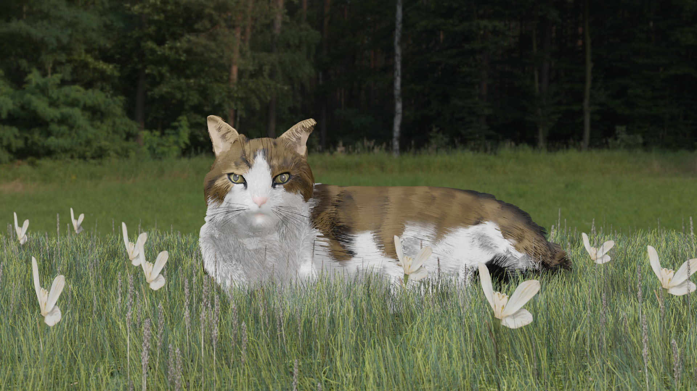
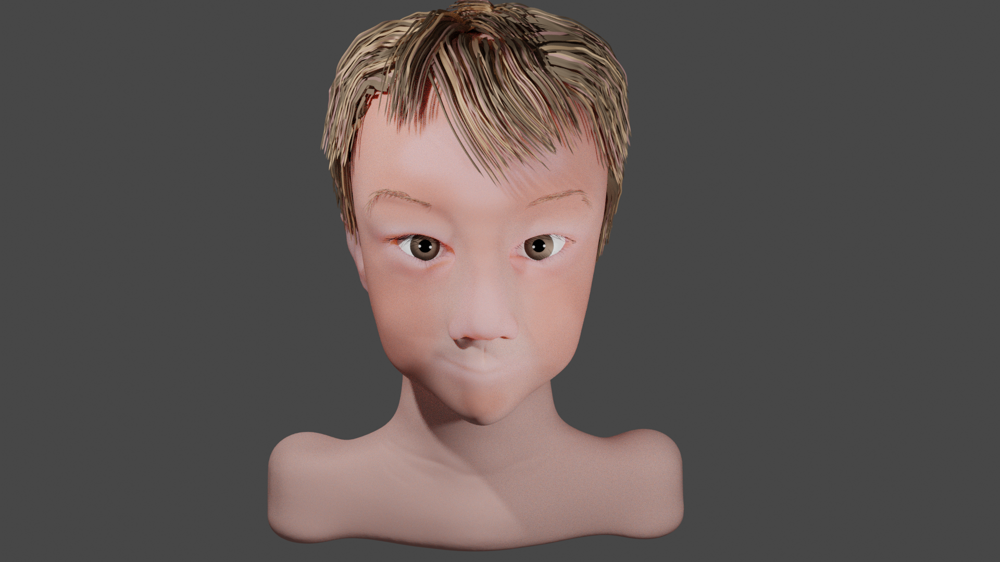
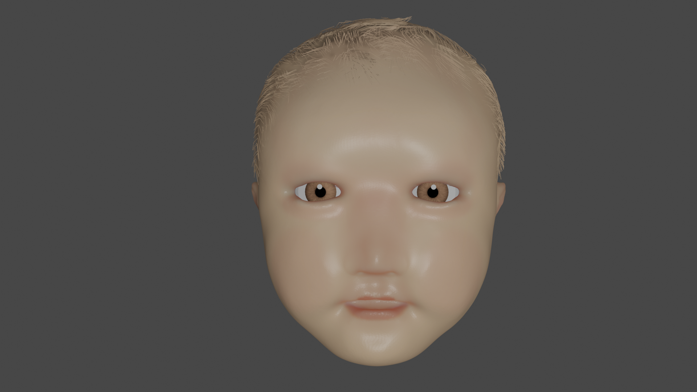
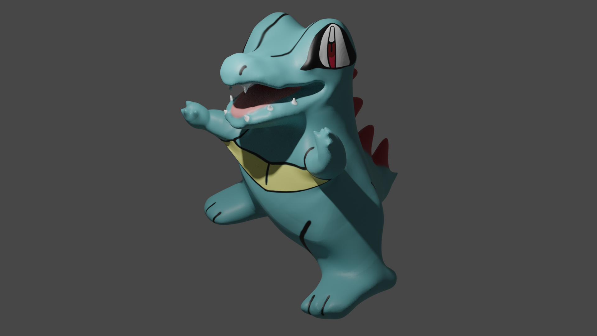
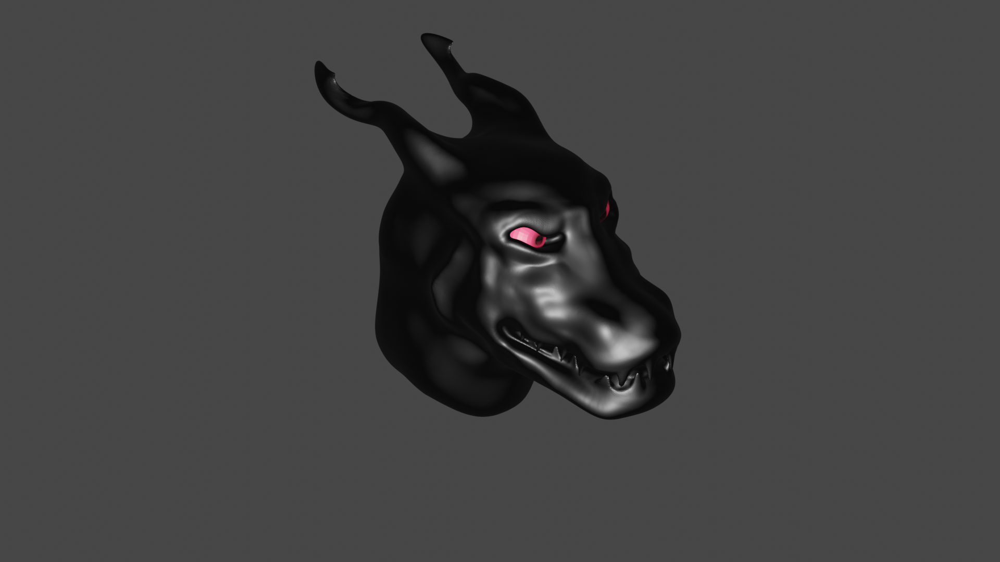
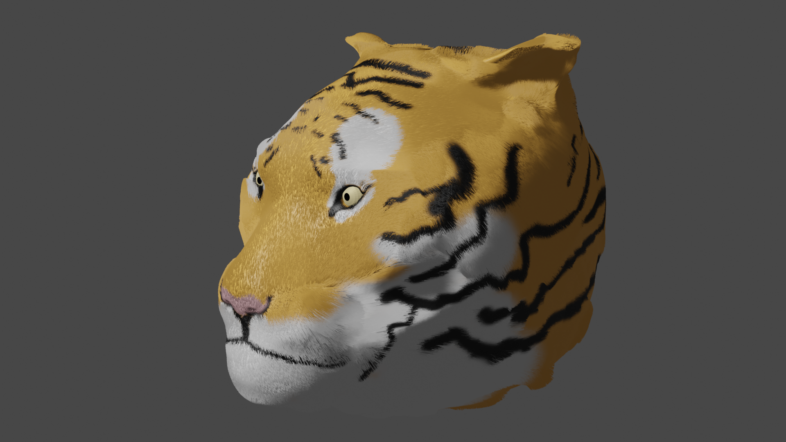
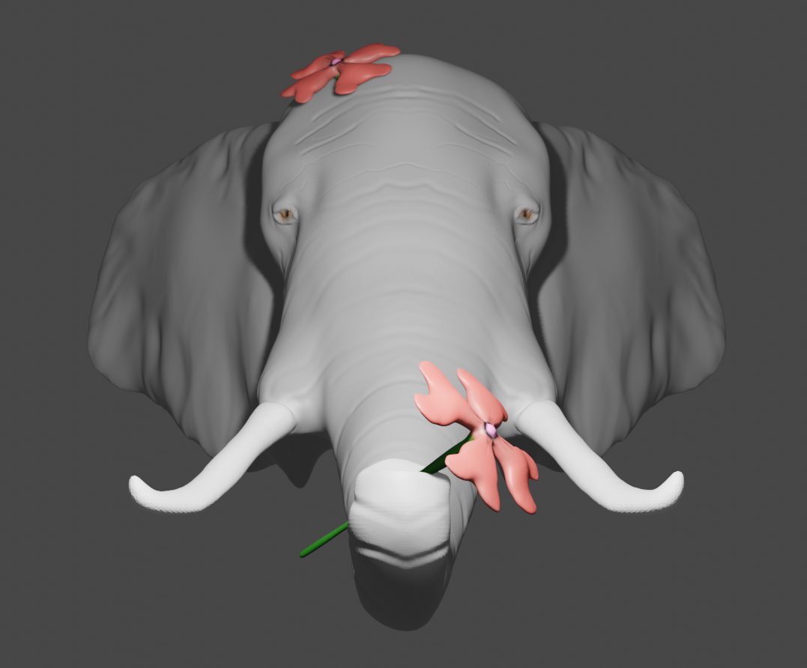

## Overview
I started learning Blender in 2022 with the Udemy class "Complete Blender Creator: Learn 3D Modelling for Beginners" by the GameDev.tv team. In this class, I learned how to navigate Blender and use its tools to build 3D models and animations. This is a timeline of my work, from beginning to now.

### Desk
My first blender project.

### Bowling

### Chess

### Lil 'Smee
A tribute to my cat.

### My Nephews

#### Wiley

#### Thor

### Totodile

### Demon Dog

### Tiger

### Elephant

