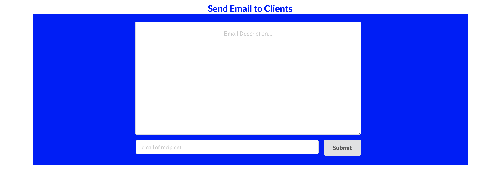
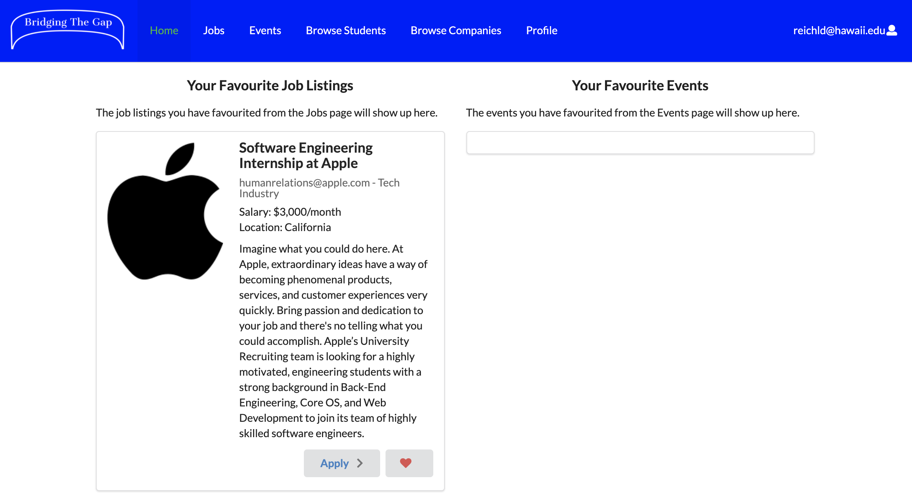

## Overview
[Bridging the Gap](https://bridging-the-gap.github.io/) is a web application that connects University of Hawaii students with companies. When you first enter the site, you will see the landing page. Here, you can read about what the site has to offer and leave feedback on what you think about the site, which will be sent to the Bridging the Gap email. Users can then sign up as either a student or company. If you sign up as a company, you will be sent to the company homepage, where you can edit your profile and add job listings and events. These will then appear on separate events and jobs pages, which all registered users can see. If you want to delete any old jobs/events, just click the "x" in the top right of the event/job in your homepage, and they will disappear from the events/jobs pages. In addition, you can view your own company profile and current job listings in the profile page.

If you sign up as a student, you will be directed to the student homepage, which is quite different from the company homepage. On the student homepage, students can keep track of jobs or events that catch their interest. To do so, students navigate to the events and jobs pages and click the heart icon in the bottom right of each event/job they like. Once they do, the event/job will appear in their homepage. Students can also unfavorite irrelevant events/jobs as needed. In addition, students also have their own profile page, and they can edit their profile by clicking the edit link in the bottom left of their profile card.

Not to mention, all users can browse through each other's profiles. On the browse students page, users can filter students by their skills, check out students' profiles, visit their websites (for instance, a github.io page), and contact them via email. This is most useful for companies searching for recruits, but may also be convenient for students who want to find others with similar interests. Similarly, on the browse companies page, users can filter companies by their location, view different company profiles, check out their websites, and get in contact with them. This functionality is most useful for student users wanting to find companies that fit their interests. However, company users may also get use out of the browse companies page because they can see what other companies are doing and how they can improve.

Aside from browsing profiles, users can also report any problems they find on the website using the report a problem page, accessible from the dropdown in the top right of the navbar in Bridging the Gap. These problems will be sent straight to the admin users. The admin role is quite different from the student and company roles. On the admin homepage, there are three main functionalities. First of all, admins can add new categories of skills and locations to filter by in the browse students and browse companies pages as more diverse students and companies join. Second, admins can view reports sent from student/company users in a table that, for each report, lists the email of the user who sent the report, the type of report (bug, user abuse, or other), and an actual description of the report. Admins can filter by the type of report, delete old reports, and delete the accounts of users who seem to be causing trouble based on the reports. Finally, admins can send emails to specific users to inform them that their issues have been resolved, that further information is needed regarding their reports, etc. In addition, admins also have access to the events, jobs, browse students, browse companies, and even the report a problem page to make sure everything is functioning correctly.
 
## My Process

### Contributions
I was one of a team of five working on the Bridging the Gap project, which was managed using [GitHub](https://github.com/) and created using the [Meteor development framework](https://www.meteor.com/). My team utilized issue-driven project management in GitHub for our project, which I discuss in a separate essay [here](https://leilani-reich.github.io/essays/software-engineering-extending-its-reach.html). My main contributions were the landing page, the admin-related pages, and the signup page. I also added in the favoriting functionality for events and jobs, helped my team when needed, and added tests for various pages including my own to ensure the system was working correctly. My team and I began our project planning out the system, choosing the pages we would create, and designing mockup pages with the help of a website called [Figma](https://www.figma.com/). Afterward, we began the actual development process using the framework known as [Meteor](https://www.meteor.com/).

### My Work 
#### Landing Page
I began my tasks by creating the landing page. First, I designed a simple logo for Bridging the Gap, which now serves as the title of the landing page. Then, I added in information about the site and its uses. Finally, I constructed in a feedback section at the bottom of the landing page. To create the fields for the feedback, I used Semantic UI React [forms](https://react.semantic-ui.com/collections/form/#types-form). To actually figure out how to send the emails, I had to do some research on my own. After learning about the email-sending tool for JavaScript called [EmailJS](https://www.emailjs.com/) and looking through different tutorials online, I was able to implement the feedback functionality successfully.


#### Admin Pages
Then I began working on the admin pages. I started out creating the report a problem page and implementing the ability for the admin to see the reports in a table in their homepage. I created a Reports collection to hold the reports made by users. Whenever a user submitted a report, this would be inserted into the reports collection. Then in the admin homepage, the report table would map through the reports and display each one in a separate row of the table. This was the basic functionality I had planned for the reports section.

Later on, I added the ability to filter through different kinds of reports. I did this in code by creating three variables (reportData1, reportData2, and reportData3) to hold report data specific to the type, using the [Underscore library filter function](http://underscorejs.org/#filter). Then, I created checks for the type of report the admin wants to search by, and map through the variable that holds data specific to that type of report. If no report type is selected, all reports are displayed. Here's some of my code mapping through different data depending on the report type the admin chooses (this.state.reportkind).

```
           {this.state.reportKind === 'bug' ?
              <Table.Body>
                {_.map(reportData1, (report, index) => <ReportItem key={index} report={report} Reports={Reports}/>)}
              </Table.Body> : <Table.Body/>
            }
            {this.state.reportKind === 'user-abuse' ?
              <Table.Body>
                {_.map(reportData2, (report, index) => <ReportItem key={index} report={report} Reports={Reports}/>)}
              </Table.Body> : <Table.Body/>
            }
            {this.state.reportKind === 'other' ?
              <Table.Body>
                {_.map(reportData3, (report, index) => <ReportItem key={index} report={report} Reports={Reports}/>)}
              </Table.Body> : <Table.Body/>
            }
            {this.state.reportKind === '' ?
              <Table.Body>
                {data.map((report) => <ReportItem key={report._id} report={report} Reports={Reports}/>)}
              </Table.Body> : <Table.Body/>
            }
```

As another additional functionality for this section, I also added the ability for admins to delete troublesome users by typing in their emails. Upon clicking submit to delete a user, a Meteor method will be called, which is a useful tool that operates on the server side and executes several statements at once. This specific Meteor method I called, the deleteProfileMethod, makes sure to delete the user from the Profiles collection and all related collections.


Afterward, I began implementing the functionality for the admin to send email to clients. Since I'd already done this for the feedback section, implementing this section was rather straightforward, except I had the admin messages be sent to specific users' emails rather than the Bridging the Gap email.



Then, I started working on the create new categories section of the homepage. Honestly, this was the easiest to implement. If the admin chose to add a new unique skill, upon submitting the form, I inserted this skill into the Skills collection. Similarly, if the admin chose to add a new unique location, I inserted this location into the Locations collection. Then, I just made sure these changes were reflected in the browse students and browse companies pages' filters. 


#### Signup Pages

While working on the admin pages, I also completed some tasks for the signup pages. The first thing I did was add the role field so that the user could choose whether they were a student or company user. Sometime later, a teammate suggested adding additional fields to the signup page so that student and company profiles would be filled out for users after signup, which was a really good idea. She added these fields in, but after looking at the signup page, I thought it would be a bit more clear if specific fields would appear after choosing the student or company button instead of everything showing up at once. As a result, I implemented this functionality. I also added some more fields for students and companies to fill out to ensure their profiles would be completely set up after they signed up. That was my work for the signup page. Here's a look at the student signup.


#### Favoriting Functionality

I also added the ability to favorite events and jobs near the end of the project. It was an idea I had after realizing that the student homepage needed some more functionality. It was tricky going about this at first. I had to figure out how to change the state and color of the favorite button after a user clicked it. This was not trivial with the way code was set up in the Bridging the Gap project for the events and jobs pages. The Semantic UI React defining what each separate event looks like was held in a JavaScript const variable outside the events class. The same went for the jobs class in the jobs page. I would have had to figure out a way to change the state of the button from outside the class, but everything I tried did not work out. So I eventually re-thought my strategy and created separate components called MakeEvent and MakeJob for creating a single event/job. In these components, they had their own classes, so it was easy to change the state of the button. Then, in the events and jobs pages, I made sure to map through the MakeEvent and MakeJob components respectively so that they would all appear. Thankfully, everything worked out in the end.



#### Testing

Testing was a separate beast thrown into the midst of the project. My team and I utilized a tool called [TestCafe](https://testcafe.io/) to test our web application throughout its development. I wrote separate test pages for my admin homepage, the report a problem page, and the landing page. I made sure that each functionality I had implemented was tested and passing the TestCafe tests. I initially included tests for email-related functionality but soon commented these out until the very end of the project for a rather amusing reason. For the emails, I had signed up for a free account on EmailJS, and I had a 200 email limit for each month. However, with five people testing the site all at once, as well as the GitHub workflow re-running tests multiple times, the emails were being used up like toilet paper. I didn't want to pay for an upgrade, and I knew the forms for the emails worked, given the tens of emails I received in my inbox, so I commented them out for most of the project.

Aside from dealing with the whole email fiasco, I updated tests as additional functionality was added. Then, near the end of the project, I also added in the favoriting functionality tests and a test for the edit student profile page. Subsequently, I reorganized the tests to ensure they were following the page object model design pattern, as discussed in the [Bowfolios project page](https://bowfolios.github.io/) "End to End Testing" subsection of the developer guide. Here's where the final dilemma of the project erupted. 

I mentioned GitHub workflows in the previous paragraph but never mentioned what they were. A workflow in GitHub Actions executes one or more jobs specified by a .yml file after some change in the project repository. In my group's case, each push to the master branch in the app repository for Bridging the Gap triggers a run of the workflow (as part of continuous integration). As the workflow runs, part of what it executes is all of our TestCafe tests. However, GitHub workflows are very strange. Tests that work locally may fail in the GitHub workflow run. That is exactly the problem I ran into the day my group was to turn in our project. In particular, tests related to favoriting events/jobs and checking that they appear in the student homepage would almost always fail in a GitHub workflow. This was extremely aggravating. Eventually, I came to a solution of increasing the wait time for the favoriting-related pages to load and deleting some unnecessary repetitive tests. Then, I finally saw the great green checkmark appear. The project was complete!

## What I Learned
I've learned quite a lot from this project. First and foremost, I learned how to work with others in a group, which I've done before of course, but never for a project this long or substantial. In addition, I discovered how to work independently. Before starting the final project, I'd always been following steps in class instructions, never really thinking too hard about what I was doing. However, with this class project, the training wheels were off, and I am thankful for it. During the project, I also realized some of my weaknesses, mainly web design. I am no Picasso when it comes to designing webpages, that's for sure. Not to mention, the Bridging the Gap design is one of the main critiques given to my team from community feedback. Nevertheless, I feel that this project was a resounding success, and I am happy to have been a part of it.

Find Bridging the Gap on [Github](https://github.com/bridging-the-gap).

