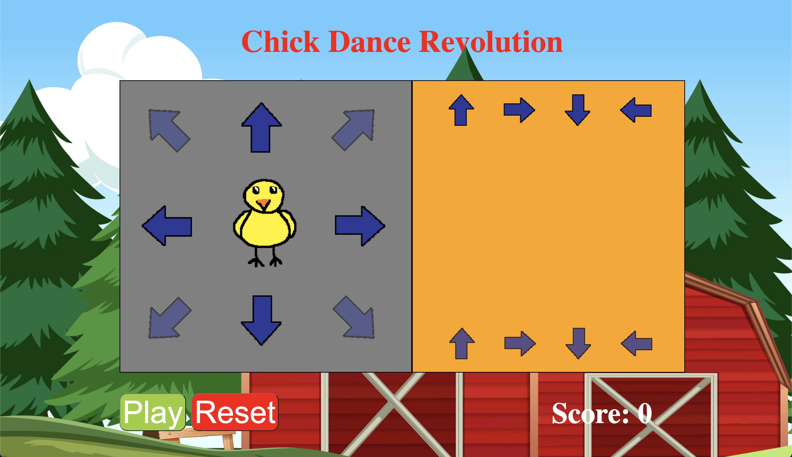

## Project Details
Chick Dance Revolution is my mentor project for [ICSpark](https://icspark.github.io/people.html), a club which provides coding mentorship (specifically web development) to 6th-12th graders.
This game revolves around a baby chicken, a chick, dancing in time to different music notes, which are represented by arrow keys. I created the game to showcase HTML/CSS/JS skills and give students a fun project to work on and enhance their understanding of web development.

## My Process

In the beginning, I had several ideas on what I wanted to do, but one thing was for certain: I wanted to make a game. Eventually, I decided on a dancing game as it seemed pretty unique and interesting to incorporate. Thus, I came up with Chick Dance Revolution. As to why I chose a chick as the main character, what can I say, I like chickens. 

To create the game, I utilized an online IDE named Replit. I started out by creating assets for all the game components. I created most of the assets, such as the chick doing different poses, on my own in [Pixilart](https://www.pixilart.com/draw). Then, I wrote the HTML and CSS, creating elements and giving structure to the game itself. Then, I worked on the JavaScript, making heavy use of event listeners, which would detect an event like a keypress and take action accordingly. Finally, I wrote instructions for how to build my project, specifically the JS section. I provided the HTML and CSS files so that students could just focus on the JS. After writing the instructions, I remade my game following them to make sure everything was clear.

## What I learned

From making Chick Dance Revolution, I learned that there's a lot more that can be done with HTML, CSS, and JS than I'd previously thought. Before joining ICSpark, I had only used these languages to build simple webpages, so it was exciting discovering the capabilities of HTML, CSS, and JS. In the future, I plan to utilize these languages further to create things like Chrome Extensions.

Play Chick Dance Revolution Here:
https://dancechickrevolution.leilanireich.repl.co/

