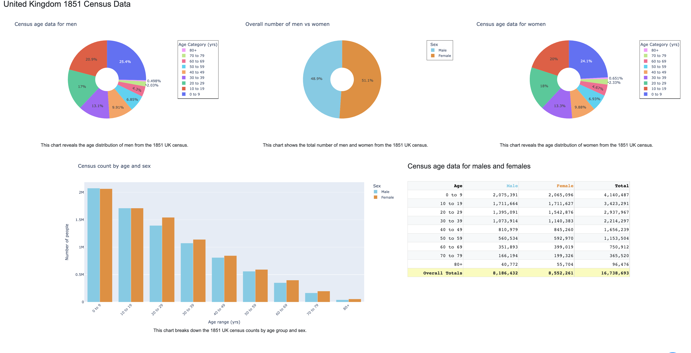

## Overview
I created a dashboard presenting information surrounding London's Cholera outbreak in 1854. I used the Jupyter Notebook IDE and Dash, a Plotly framework, to build my dashboard. The dashboard itself is made up of tables, line graphs, bar charts, pie charts, and a map. I spent a lot of time improving my visual elements. To do so, a main component was Dash Bootstrap, which allowed me to organize my dashboard neatly with rows and columns for separate elements. In addition, I worked to make my tables, graphs, and charts as clear as I could for the average viewer to understand. This involved adding legends with appropriate variables and markers, right-aligning my numbers in my tables and adding commas when necessary, crafting hovertemplates so that viewers could clearly understand a piece of data they put their mouse on, and using colorblind-friendly colors. I've learned much about data visualization from this project, and I hope to further my skills with future endeavors.

Here is a snippet from my dashboard:

The full project is available on GitHub: [Cholera-Dashboard](https://github.com/leilani-reich/London-Cholera-DashBoard)

