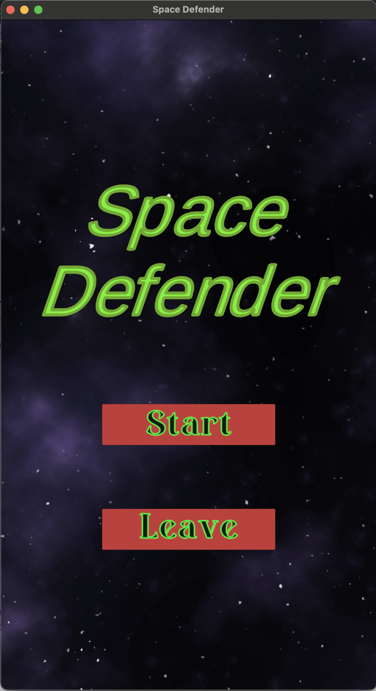
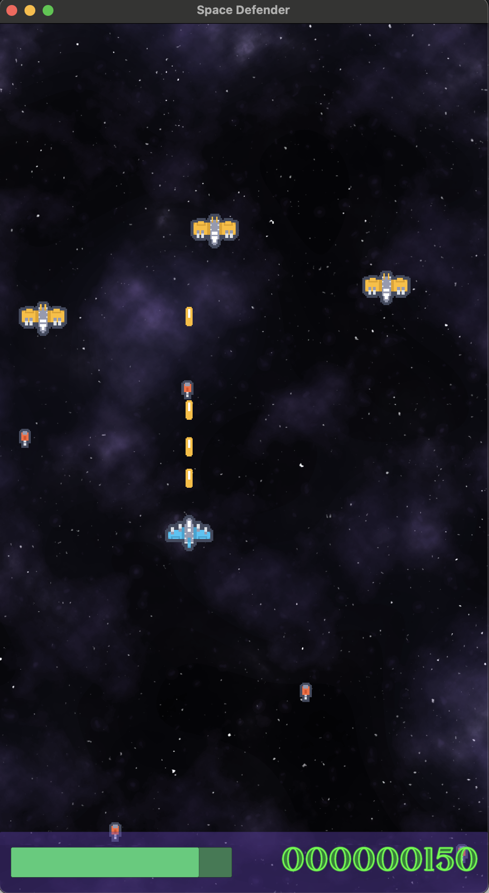
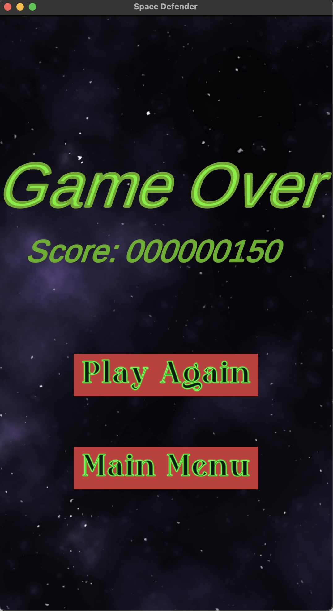

## Overview
I created a space shooting game using Unity2D. This game was part of the Complete C# Unity Game Developer 2D course by the GameDev.tv.
This project gave me experience using C# scripts and the Unity2D platform. I learned how to apply C# scripts to different prefabs, build
canvases for different screens, and intertwine all elements of the game together.

### Start Screen:

### Game Screen:

### End Screen:

Check out the game here: [Space Defender](https://sharemygame.com/@LDR/space-defender)
